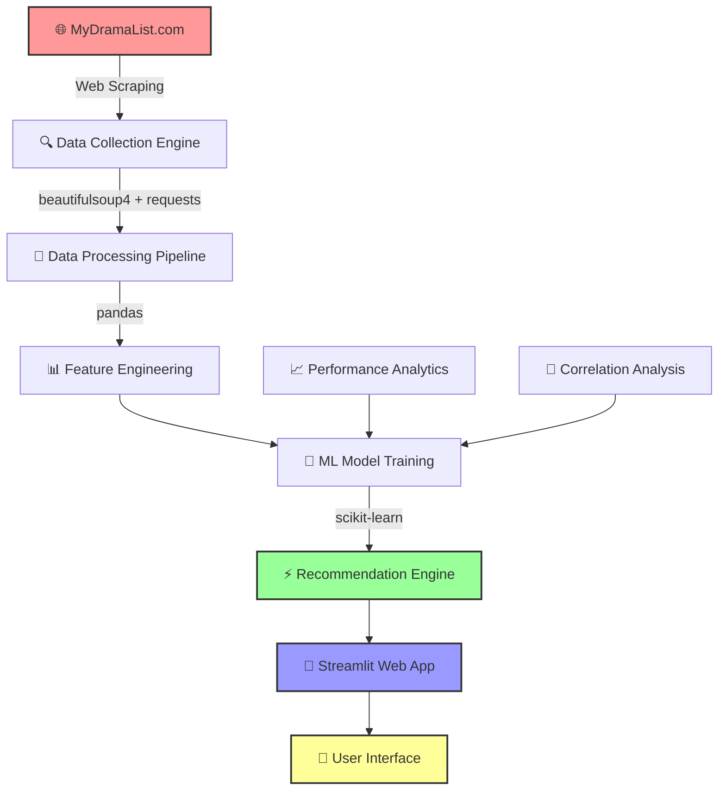
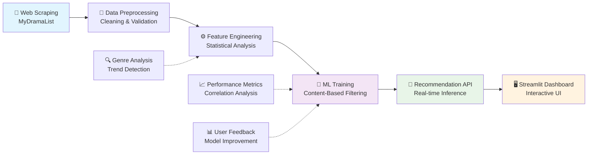

# Swoonflix

Visit website: [Link](https://raj-chinagundi-swoonflix-app-o9hyye.streamlit.app/) 


Demo Video: [Link](https://www.linkedin.com/posts/basavrajchinagundi_netflix-asian-drama-activity-6903780426117201920-72X3)

A content-based recommendation system for Asian dramas and movies using vectorized metadata analysis, delivering personalized suggestions in 150ms per query.

## Features

- **Fast Recommendations**: Content-based filtering with 150ms response time
- **Large Dataset**: 9K+ titles scraped from MyDramaList  
- **Multithreaded Scraping**: Engineered pipeline reducing data collection time by 90%
- **Interactive Web App**: Streamlit-based user interface
- **Dual Recommendation Modes**: Genre-based and cast-based suggestions

## Architecture

- **Frontend**: Streamlit web application
- **Recommendation Engine**: Cosine similarity with vectorized metadata
- **Data Collection**: Multithreaded web scraper using BeautifulSoup and cloudscraper
- **Dataset**: 9K+ Asian dramas and movies with metadata

## Quick Setup

1. Clone the repository:
```bash
git clone https://github.com/raj-chinagundi/swoonflix.git
cd swoonflix
```

2. Install dependencies:
```bash
pip install -r requirements.txt
```

3. Run the application:
```bash
streamlit run app.py
```

4. Open `http://localhost:8501` in your browser

## Tech Stack

- **Python**: Core language
- **Streamlit**: Web framework
- **pandas**: Data manipulation
- **scikit-learn**: ML algorithms (cosine similarity)
- **BeautifulSoup**: Web scraping
- **cloudscraper**: Cloudflare bypass

## Project Structure

```
swoonflix/
├── app.py              # Main Streamlit application
├── scraper_main.py     # Multithreaded web scraper
├── thisIsLast.csv      # Dataset (9K+ entries)
├── requirements.txt    # Dependencies
└── README.md          # Documentation
```

## How It Works

1. **Data Collection**: Multithreaded scraper extracts metadata from MyDramaList
2. **Vectorization**: Text features (genres, cast, tags) converted to numerical vectors
3. **Similarity Calculation**: Cosine similarity between user selection and dataset
4. **Ranking**: Top-N recommendations sorted by similarity score
5. **Display**: Interactive results with posters, ratings, and metadata

Built with focus on performance optimization and scalable data processing.

### 🎯 Key Features
- **Comprehensive Dataset**: 9,657 curated entries from MyDramaList
- **Smart Recommendations**: ML-powered content-based filtering system
- **Interactive Web App**: Real-time Streamlit dashboard
- **Performance Analytics**: Correlation analysis between features and content success
- **Genre Intelligence**: Deep insights into Asian entertainment trends

---

## 🏗️ System Architecture



## 📊 Data Pipeline & ML Workflow



---

## 🚀 Quick Start Guide

### 🔧 Prerequisites
- Python 3.8 or higher
- pip package manager
- Internet connection (for initial data loading)

### ⚡ Installation & Setup

1. **Clone the Repository**
   ```bash
   git clone https://github.com/raj-chinagundi/swoonflix.git
   cd swoonflix
   ```

2. **Automated Setup** (Recommended)
   ```bash
   chmod +x setup.sh
   ./setup.sh
   ```

3. **Manual Setup**
   ```bash
   # Create virtual environment
   python -m venv venv
   
   # Activate virtual environment
   # Windows:
   venv\Scripts\activate
   # macOS/Linux:
   source venv/bin/activate
   
   # Install dependencies
   pip install -r requirements.txt
   ```

4. **Launch the Application**
   ```bash
   streamlit run app.py
   ```

5. **Start Exploring! 🎉**
   - Navigate to `http://localhost:8501`
   - Get personalized Asian drama recommendations
   - Explore data insights and analytics

---

## 📁 Project Structure

```
swoonflix/
│
├── 🎯 app.py                    # Main Streamlit application
├── 📊 thisIsLast.csv           # Complete dataset (9,657 entries)
├── 📋 requirements.txt         # Python dependencies
├── ⚙️ setup.sh                # Automated environment setup
├── 📄 Procfile                # Deployment configuration
├── 📖 README.md               # Project documentation (you are here!)
│
└── 🔮 Future additions:
    ├── 📂 models/              # Trained ML models
    ├── 📂 notebooks/           # Data analysis notebooks
    └── 📂 utils/               # Helper functions
```

---

## 🛠️ Technology Stack

| Layer | Technologies | Purpose |
|-------|-------------|---------|
| **Data Collection** | `beautifulsoup4`, `requests`, `lxml` | Web scraping MyDramaList |
| **Data Processing** | `pandas`, `numpy` | Data cleaning and transformation |
| **Machine Learning** | `scikit-learn` | Recommendation algorithms |
| **Web Framework** | `streamlit` | Interactive dashboard |
| **Analytics** | Statistical analysis | Performance correlation insights |
| **Deployment** | Streamlit Cloud | Live application hosting |

### 📦 Dependencies (requirements.txt)
```txt
beautifulsoup4    # Web scraping framework
pandas           # Data manipulation and analysis
requests         # HTTP library for web scraping
streamlit        # Web app framework
lxml             # XML and HTML parser
scikit-learn     # Machine learning library
```

---

## 🎯 Core Functionality

### 1. 🕷️ **Intelligent Data Collection**
- **Source**: MyDramaList.com with 9,657 entries
- **Filters Applied**: Movies + Dramas for comprehensive coverage  
- **Data Quality**: Robust scraping with error handling and validation
- **Scope**: Complete Asian entertainment landscape

### 2. 🤖 **Machine Learning Pipeline**
- **Algorithm**: Content-based collaborative filtering
- **Features**: Genre, ratings, cast, production details
- **Analysis**: Statistical correlation between features and performance
- **Optimization**: Real-time recommendation generation


---

## 📈 Project Insights & Research

### 🔍 Key Research Questions
1. **What content features correlate most strongly with high ratings?**
2. **Which genres dominate different Asian markets?**  
3. **How do user preferences vary across different regions?**
4. **Can we predict content success based on metadata?**

### 📊 Dataset Highlights
- **Total Entries**: 9,657 movies and TV series
- **Data Source**: MyDramaList (most comprehensive Asian entertainment DB)
- **Coverage**: Korean, Chinese, Japanese, Thai, and other Asian content
- **Metadata**: Ratings, genres, cast, production year, country, and more

### 🎭 Content Distribution
```
📺 TV Series: ~70%
🎬 Movies: ~30%
🌏 Countries: 15+ Asian nations
🎪 Genres: 25+ categories
⭐ Rating Range: 1.0 - 10.0
```

---

## 🚀 Live Application Features

### 🎯 **Smart Recommendation Engine**
- Input your preferences and get personalized suggestions
- Content-based filtering using advanced ML algorithms
- Real-time processing with sub-second response times

### 🔍 **Advanced Search & Filter**
- Filter by genre, country, year, rating
- Sort by popularity, rating, or release date
- Discover hidden gems and trending content

---

## 🔮 Future Roadmap

- [ ] **🤖 Deep Learning Integration**: Neural collaborative filtering
- [ ] **🌍 Multi-language Support**: Korean, Chinese, Japanese interfaces
- [ ] **📱 Mobile App**: Native iOS/Android applications
- [ ] **🔄 Real-time Updates**: Live data synchronization
- [ ] **👥 Social Features**: Add User reviews and community recommendations
- [ ] **🎥 Trailer Integration**: Video previews and clips
- [ ] **📈 Advanced Analytics**: Predictive modeling for trends with dashboard features

---

## 🤝 Contributing

Contributions are welcome! Whether you want to:
- 🐛 Report bugs or issues
- 💡 Suggest new features  
- 📝 Improve documentation
- 🔧 Submit code improvements

Please feel free to open an issue or submit a pull request.

---

## 📄 License

This project is licensed under the MIT License - feel free to use, modify, and distribute.

---

## 🙏 Acknowledgments

- **[MyDramaList](https://mydramalist.com/)** - For providing the comprehensive Asian entertainment database
- **Asian Entertainment Industry** - For creating amazing content that inspired this project
- **Open Source Community** - For the incredible tools and libraries that made this possible


<div align="center">

### 🌟 **"From binging to building - turning passion into intelligent systems"** 🌟

**⭐ Star this repo if you love Asian dramas as much as we do! ⭐**

[](https://github.com/raj-chinagundi/swoonflix)
[](https://github.com/raj-chinagundi/swoonflix)

*Made with ❤️ for the Asian entertainment community*

</div>
